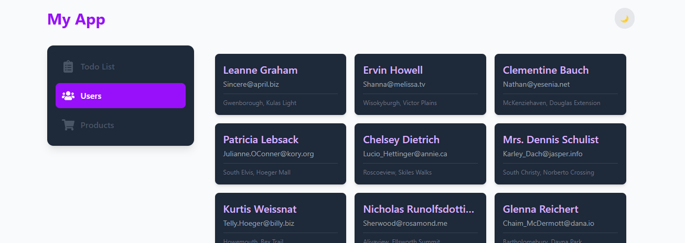

# Frontend Technical Test - React + TypeScript

 

## Project Overview

A responsive todo application with product listing and user management features, built with:

- React 18
- TypeScript
- Tailwind CSS
- React Router
- Context API for state management



## Features

### Core Functionality
✅ Dark/Light mode toggle  
✅ Todo list with CRUD operations  
✅ Product listing from FakeStore API  
✅ User management interface  
✅ Responsive design  

### Technical Highlights
⚛️ React functional components with Hooks  
🔷 TypeScript type safety  
🎨 Tailwind CSS for utility-first styling  
🔗 React Router for navigation  
📱 Fully responsive layout  
🌓 System-preference aware dark mode  

### 1. ¿Cómo te organizas cuando trabajas en equipo con otros desarrolladores?

Normalmente me gusta mantener una comunicación clara desde el inicio. Uso herramientas como Git para trabajar en ramas bien organizadas y plataformas como Jira o Trello para seguir el avance del proyecto. Si trabajamos con *dailies* o revisiones de código, participo activamente porque creo que eso ayuda a que todos estemos en la misma página. Siempre trato de dejar todo bien documentado para que cualquier persona del equipo pueda seguir el hilo sin problemas.

---

### 2. ¿Has usado alguna metodología ágil como Scrum o Kanban?

Sí, he trabajado con Scrum, aunque conosco un poco del marco de Kanban. Me he acostumbrado a tener reuniones diarias, planear *sprints*, hacer retrospectivas, y eso me ha ayudado a organizar mejor mis tareas y adaptarme a los cambios. 

---

### 3. ¿Qué harías si te asignan una tarea con una tecnología que no conoces?

Lo primero que hago es investigar bien: reviso la documentación oficial, videos cortos, artículos, lo que me ayude a entender cómo funciona. Me gusta hacer pruebas rápidas por mi cuenta para ver cómo se comporta la tecnología. Si tengo dudas más puntuales, no dudo en preguntarle al equipo. Tambien me gusta usar herramientas de inteligencia artificial, como son ChatGpt o Cursor AI

### El punto % lo puedes encontrar en la siguiente Ruta REACT/TodoTest/MVC

### Para ejecutar las pruebas unitarias, ejecuta en el aterminar 
```bash
npm test
```